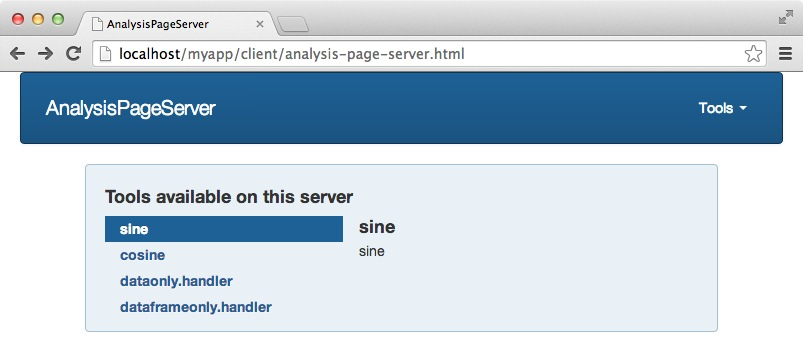

<!--
%\VignetteEngine{knitr::knitr}
%\VignetteIndexEntry{6. Apache Deployment}
-->

<link rel="stylesheet" type="text/css" href="AnalysisPageServer.css">

```{r echo = FALSE}
options(markdown.HTML.options = "toc")
```

# Deployment with Apache


## Apache versus Rook deployment

The main advantages of deploying your application using Apache instead
of using Rook from with R is *stability*.
Anecdotally, Rook is unstable and should not be left unsupervised.
Before long the server usually becomes
unresponsive. Apache, on the other hand, has several features which increase its stability, such as
*Parallelization*. Apache normally comes configured with modules such as `prefork.c` which 
maintains multiple children processes to handle incoming requests. If any child crashes the
parent process automatically respawns a new one. `AnalysisPageServer`
takes advantage of this even further and has the children kill themselves if they are using too much
memory (by sending themselves `SIGUSR1`&mdash;this is an esoteric feature which an Apache process
interprets to mean "finish serving this request and then quit").

Aside from this, Apache is a fully mature piece of software, and many other tools are available
for monitoring, logging, deployment, etc. You could also use mod_proxy to solve cross-domain issues
for your services (e.g. if you want your search-aheads to be from another system).

The downsides of using Apache instead of Rook are much more complicated installation and
initial setup, and slower server start/restart.

In short, Rook is the preferred deployment
for prototyping, development, debugging. It could also be considered for single-user mode,
where the only user of the web application is going to be the same person who is starting the
server from within R, and who doesn't mind restarting it every time it crashes.

If other people are going to be using it, and in particular if you want it to keep running
after you go home and on the weekends, you'll need to invest in setting up an Apache deployment.

The good news is that I'll show you how to do it through the next few steps of this document.

## Install Apache

Hopefully this is already done for you. If you are running on OS X you probably already have it.
If you are running any modern linux distro it probably comes installed, and if not there it can be installed with your
package manager.

## Install RApache

Go to [http://rapache.net](http://rapache.net) and follow the instructions there. A big shout-out to Jeff Horner who is the author of
RApache (and Rook, by the way)...and who always answers his e-mails when I have questions!

## Application directory

We are going to create a few configuration-type files for the application so it
is convenient to put them all the same directory. Let's create that directory.

```{r echo = FALSE}
app.basedir <- "rapache-example"
if(file.exists(app.basedir))
  unlink(app.basedir, recursive = TRUE)
```

```{r message = FALSE}
library(AnalysisPageServer)
app.basedir <- "rapache-example"
dir.create(app.basedir)
app.basedir <- normalizePath(app.basedir)
app.basedir
```

## Startup script

First you'll create a startup script. This will consist of building an `AnalysisPageRegistry`, then
from that an `AnalysisPageRApacheApp`. and finally calling the special method `add.handlers.to.global` of the
application object.

Here is an example. We'll use an example Registry that comes with `AnalysisPageServer`:

```{r eval = FALSE}
library(AnalysisPageServer)
reg <- AnalysisPageServer:::trig.registry()
app <- rapache.app.from.registry(reg,
                                 tmpdir = tempdir())
app$add.handlers.to.global()
```

Place this file in `rapache-example/driver.R`.

```{r echo = FALSE}
writeLines("library(AnalysisPageServer)
reg <- AnalysisPageServer:::trig.registry()
app <- rapache.app.from.registry(reg,
                                 tmpdir = tempdir())
app$add.handlers.to.global()", file.path(app.basedir, "driver.R"))
```

It is good engineering to keep this script as lean as possible. A nice way
to organize it is to develop an R package just for your application. It should
provide a function that builds an AnalysisPageRegistry, and then you can also
have a four-line script.

Putting any more logic in this driver script makes it difficult to test and maintain.


## Decide on Location of your application

By "Location" here I mean the prefix of the URL. In the example for this
page we'll put it under `/myapp`. That means that all of the resources
and URLs related to the application would start with something like
`http://server-name.com/myapp`.

## Config.js file

Next you'll need to customize the Javascript configuration file. There is an R function to
write this for you. We'll save it to `rapache-example/config.js`.

```{r}
app.prefix <- "/myapp"
config.lines <- config.js(app.prefix = app.prefix)
config.js.path <- file.path(app.basedir, "config.js")
writeLines(config.lines, file.path(app.basedir, "config.js"))
```


## AnalysisPageServer-specific httpd.conf

Next you'll have to set up an httpd.conf file for your server. The function `apache.httpd.conf` can write this for you.
Let's put it next to the other files in `rapache-example`.

One thing you'll need to know is the path to `mod_R.so`, which is the RApache you just installed.

Usually this is in the directory with the other Apache extensions, and this is
reported by the `apxs` or `apxs2` executable, with arguments `-q LIBEXECDIR`.
You might need to use the full path to this tool, which is sometimes installed
in `/sbin` or `/usr/sbin`. On my (OS X) laptop the full path is `/usr/libexec/apache2/mod_R.so`.

Continuing our example:

<!---
Using eval=FALSE in the next block otherwise
an error is thrown that mod.R.path does not exist on the build server
--->

```{r eval = FALSE}
driver.path <- file.path(app.basedir, "driver.R")
app.location <- "/myapp"

conf.lines <- apache.httpd.conf(driver.path = driver.path,
  app.location = app.prefix,
  config.js.path = config.js.path,
  mod.R.path = "/usr/libexec/apache2/mod_R.so")

httpd.conf.path <- file.path(app.basedir, "myapp-httpd.conf")

writeLines(conf.lines, httpd.conf.path)
```

## Include your app's httpd.conf in the system httpd.conf

At this point you have an httpd.conf which is not too bad, but it doesn't really
stand on its own. If you are running off your laptop or a small machine on which
you have root access then you can just slip this line in the end of your system httpd.conf:

```
Include /Users/friedmab/EP/AnalysisPageServer/vignettes/rapache-example/myapp-httpd.conf
```
And restart your apache server, maybe something like
```
sudo apache restart
```

Finally you can point your browser to the landing page
`http://localhost/myapp/client/analysis-page-server.html`.

<p class="centered"></p>

This looks just like the Rook deployment, but it will work if you connect from another machine
and it will be generally more stable.

## Deployment if you don't have the right to modify the system Apache configuration

If you don't have the right to modify the configuration of the shared Apache server
then you'll have to make your own apache. You may be able to do this
by copying the system apachectl script and modifying the path to the httpd.conf file.
Then make a copy of the system httpd.conf file and point your private apachectl to use
that. Be sure to Include your application's specific httpd.conf file.
Set your PidFile, LockFile, ErrorLog and CustomLog to write to
your local directory and not conflict with the system apache. Update your Listen directive
to your a high port. Good luck!

--------
# Next
[Deployment with FastRWeb](FastRWebDeployment.html)
