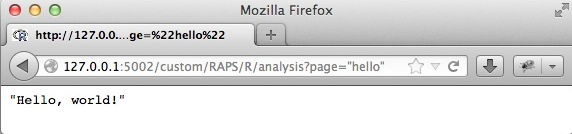
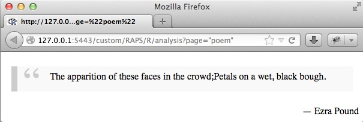

<!--
%\VignetteEngine{knitr::knitr}
%\VignetteIndexEntry{4. Non-interactive servers and Rook Deployment}
-->

<link rel="stylesheet" type="text/css" href="AnalysisPageServer.css">


# Non-interactive servers and Rook Deployment

At the heart of the server side of the AnalysisPageServer system is a mapping from
handler functions to web services. You define the set of functions to
represent by building an `AnalysisPageRegistry`, then deploy
the application either in Rook (running in your local R server)
or under Apache using the [Rapache](http://rapache.net/) system.

Your handler functions are built into objects called `AnalysisPage`s.
Each `AnalysisPage` can be a service, which might return for example
some arbitrary JSON string, or it can be a fully interactive page,
for example making a plot and returning a data frame. This document
explains the simpler service-type `AnalysisPage`. It
also explains how to deploy your application with Rook. Interactive
pages and servers are described on [another page](InteractiveApps.html).

## Rook >= 1.1 + fork

Rook version >= 1.1 and fork are required for the examples in this vignette. I am going to
check if they are available.


```
## Rook >= 1.1 or fork is not available, so although you can still use the static reporting
## features of AnalysisPageServer, and deploy dynamic servers with FastRWeb and RApache, you
## will not be able to deploy using Rook/Rhttpd, or build this vignette properly. You'll see
## the message "Rook >= 1.1 + fork not available" at all the points in this vignette where
## Rook+fork would have been required: starting the server, querying the server and stopping
## the server. If you want you can install/update the missing dependencies like this:
## 
##   install.packages("fork")
##   install.packages("devtools")
##   library(devtools)
##   install_github("Rook", "jeffreyhorner")
```


-----------------

## The simplest AnalysisPage

service-type `AnalysisPage`s are built with the `build.service()`
constructor. All you have to do is pass a handler function to it and
give it a name:


```r
library(AnalysisPageServer)
hello <- build.service(function()  "Hello, world!",
                       name = "hello")
class(hello)
```

```
## [1] "AnalysisPage"
```

> Note: Even though, as we will demonstrate in a moment, this is just a service and not a full-blown web page we still call it an `AnalysisPage`.
Since, from the server's point of view, there is not much difference between a webservice and
a web page, in this documentation I usually just say "page" when saying "page or service" would
be more accurate.

## The simplest AnalysisPageRegistry

Next we build an `AnalysisPageRegistry`. This example only has one
`AnalysisPage`, not too interesting, but we still need this object:


```r
reg <- new.registry(hello)
class(reg)
```

```
## [1] "AnalysisPageRegistry"
```

An `AnalysisPageRegistry` is not much more than a lookup for
`AnalysisPage`s. You can get the names of all registered pages:


```r
pages(reg, include.services = TRUE)
```

```
## [1] "hello"
```

The `include.services` switch has to be turned on because the default
is to return only the interactive pages, and `hello` is not interactive.

You can retrieve a particular page:


```r
identical(get.page(reg, "hello"), hello)
```

```
## [1] TRUE
```

## From AnalysisPageRegistry to Rook App

Once the registry object is built it can be 
deployed. In this documentation page we'll deploy all of our applications via
Rook using the local R server. This is useful for development
and informal purposes but for production scale an <a
href="ApacheDeployment.html">RApache</a> or <a href="FastRWebDeployment.html">FastRWeb</a> deployment</a>
is required. The combination of Rook+Rhttpd does not handle concurrency well and 
generally tends to crash a lot. Also, some
versions of Rook will only listen on the local lookback device,
which would prevent sharing your server with anyone else.

> Note: Your choice of deployment is completely
independent of how you build the `AnalysisPageRegistry`, which is the
main focus of this documentation page.

Now we'll start the server:


```r
port <- 3324  ## or some other port
server <- startRookAnalysisPageServer(reg, port = port)
server
```

"Rook >= 1.1 + fork not available"

Be aware that the function `startRookAnalysisPageServer`
starts the server in a new process. This seems slightly more stable than the typical
Rook deployment in the same process, where your continued computations might interfere
with incoming requests. In particular, if you try to call to the server from the
same R process it would hang. The object that this function returns can be
passed to `kill.process()` to turn
off the server:


```r
kill.process(server)
```

"Rook >= 1.1 + fork not available"

The downside of starting a new process is that you might forget about it when you quit R.
Not only does this waste system resources, but it actually holds on to the port, which means
you won't be able to start another server on that port.
To protect against this, you should get in the habit of starting your servers with two lines of code:


```r
server <- startRookAnalysisPageServer(reg, port = port)
on.exit(try(kill.process(server)))
```

The second line registers an expression to evalute when R exits, which ensures that the
children don't survive. Since the triggering of these `on.exit` handlers is a bit tricky
in the `knitr` environment
we'll make explicit calls to `kill.process(server)` in this document.


If you are a Rook nerd and want to do fancier things, like combine this Rook app with other applications,
then you can get the Rook App object like this:


```r
app <- new.rook.analysis.page.app(reg)
```

With this object you also have the possibility of deploying your server in the normal
Rook way, which avoids using the `fork` package.


```r
rook.server <- Rook::Rhttpd$new()
rook.server$add(app, name = "RAPS")
rook.server$start(port = port)

## Ping the server from another R process or from your web browser ...

## Then stop the server
rook.server$stop()
```

"Rook >= 1.1 + fork not available"

## Starting the server

We provide the `startRookAnalysisPageServer()` function to start
your server, rather than interfacing directly with `Rook::Rhttpd()`. 
This function accepts an `AnalysisPageRegistry` object, so you don't
have to build your Rook object, and also uses the `fork` package to
start the server in a child process. This lets us call to the server
from the parent process, which would otherwise block. It also makes
it easy to recover from disaster by simply killing the child process
without having to restart the parent R process.

Let's turn the server back on and see how it works.


```r
server <- startRookAnalysisPageServer(reg, port = port)
```

Then open your web browser:

<p class="centered"></a>

> Dissecting the URL: "127.0.0.1" is the loopback device that Rook
uses---it means your local host. The port is an arbitrary choice for this
demonstration page (sorry if the port from this screen shot does not match
the port in this documentation). If you don't specify a port then Rook/R will
choose one for you at random, and each time you try your server you
will have to modify the port. The "/custom" prefix cannot be
modified---that is how Rook+Rhttpd works. "RAPS" is what I've named the
server within Rook. "R/analysis" is a prefix within the
`AnalysisPageServer` system, which is the location from which all the
pages are served. Finally, the name of the page is JSON-encoded to
form the full request.

Once the server is running we could query it in theory from any language
and possibly even remotely. In this document we will demonstrate
the server is working by constructing the URL (using the `service.link`
function) and then calling `readLines()`.


```r
app.base.url <- paste0("http://127.0.0.1:", port, "/custom/RAPS")
url <- service.link(page = "hello", app.base.url = app.base.url)
cat(readLines(url, warn = FALSE), "\n")
```

```
## "Rook >= 1.1 + fork not available"
```

(`warn = FALSE` is added to the `readLines` call to suppress a warning
message about incompete final lines.)

That's "Hello, World!".

Astute observers will note that the greeting string was quoted in the response, even though it was
displayed with `cat` rather than just normal R output. The reason for this is
that all responses are automatically JSON-encoded. More on this later, and also how to turn it off.


```r
kill.process(server)
```

"Rook >= 1.1 + fork not available"


## Example: Multiple services in one application

Let's put two pages in the same application. We'll re-use the `hello`
page but also have a page which calculates the sine of an argument:


```r
sine <- build.service(function(theta)  sin(theta),
     name = "sine")

reg <- new.registry(sine, hello)

server <- startRookAnalysisPageServer(reg, port = port)
```

As mentioned above, all of the return values are by default
JSON-encoded. We can use the `fromJSON` function in R to turn them
back into R objects. For demonstration purposes within this document
we'll wrap up the steps of constructing the URL, calling the server,
and decoding the response into a function:


```r
show.analysis <- function(page, params = list(), show.url = FALSE)  {
  url <- service.link(page, params, app.base.url)
  if(show.url)  cat(url, "\n")
  response <- readLines(url, warn = FALSE)
  rjson::fromJSON(response)
}

show.analysis("hello", show.url = TRUE)
```

```
## http://127.0.0.1:3324/custom/RAPS/R/analysis?page=%22hello%22
```

```
## [1] "Rook >= 1.1 + fork not available"
```

```r
show.analysis("sine", list(theta = 3.141592653), show.url = TRUE)
```

```
## http://127.0.0.1:3324/custom/RAPS/R/analysis?page=%22sine%22&theta=3%2E141592653
```

```
## [1] "Rook >= 1.1 + fork not available"
```

```r
kill.process(server)
```

"Rook >= 1.1 + fork not available"

## Example: JSON encoding of complex return value

Whatever your function returns will be JSON encoded with `toJSON`.


```r
cx.return <- build.service(function()  {
  list(A = 1:5,
       B = "Able was I",
       C = list(x = 1, y = c(TRUE, FALSE, TRUE)))
}, name = "complex")
reg <- new.registry(cx.return)
server <- startRookAnalysisPageServer(reg, port = port)

show.analysis("complex")
```

```
## [1] "Rook >= 1.1 + fork not available"
```

```r
kill.process(server)
```

"Rook >= 1.1 + fork not available"

## Example: URL and JSON decoding of parameter values

The parameters are URL decoded then JSON decoded and *then* passed to
your function. This handler takes a complicated structure and an
integer as parameters. The structure should be a hash with an array
element keyed by "A". The element of that array indexed by the
integer is returned.


```r
cx.param <- build.service(function(struct, n)  {
  ## In Javascript:
  ## struct["A"][n - 1]
  struct$A[n]
}, name = "cxpar")
reg <- new.registry(cx.param)
server <- startRookAnalysisPageServer(reg, port = port)

show.analysis("cxpar", list(struct = list(A = c(3,1,4,1,5,9,2,6,5,3)), n = 6), show.url = TRUE)
```

```
## http://127.0.0.1:3324/custom/RAPS/R/analysis?page=%22cxpar%22&struct=%7B%22A%22%3A%5B3%2C1%2C4%2C1%2C5%2C9%2C2%2C6%2C5%2C3%5D%7D&n=6
```

```
## [1] "Rook >= 1.1 + fork not available"
```

```r
kill.process(server)
```

"Rook >= 1.1 + fork not available"

## Example: Arbitrary response

Sometimes the automatic JSON encoding of the response is a hassle. Or,
you might want to set the MIME type of the response. If you explicitly
return an `AnalysisPageResponse` object then you can have finer
control. This is done with the `new.response` constructor.

In this example we return a complete HTML page.


```r
poem.file <- system.file("examples/in-a-station-of-the-metro.html", package="AnalysisPageServer")
poem.html <- readLines(poem.file, warn = FALSE)
poem <- build.service(function()  {
  new.response(paste0(poem.html, "\n"),
               content.type = "text/html")
}, name = "poem")
   
reg <- new.registry(poem)
server <- startRookAnalysisPageServer(reg, port = port)

url <- service.link("poem", app.base.url = app.base.url)
readLines(url, warn = FALSE)
```

"Rook >= 1.1 + fork not available"

Or open it in the browser:

<p class="centered"></a>


```r
kill.process(server)
```

"Rook >= 1.1 + fork not available"

## Example: Plot response

The `new.response` constructor lets us return other things. For
example, we could even put a plot into the response. Let's encode the
Maunga Whau Volcano plot that we did in the <a
href="StaticContent.html">static content example page</a>. We'll use
R's `readBin` to read it into a raw vector since it is binary data.

The single parameter to the function will be an array of colors to use
for the color ramp.


```r
volcano <- build.service(function(colors = c("red","white","purple"))  {
  plotfile <- tempfile(fileext = ".png")
  png(plotfile, width = 600, height = 400)
  par(mar=c(1, 1, 4, 1))
  col <- colorRampPalette(colors)(50)
  image(datasets::volcano, xaxt = "n", yaxt = "n", main = "Maunga Whau Volcano",
        col = col, cex.main = 2)
  dev.off()

  plot.data <- readBin(plotfile, "raw", n = file.info(plotfile)[, "size"])

  new.response(body = plot.data,
     content.type = "image/png")
}, name = "volcano")
reg <- new.registry(volcano)
server <- startRookAnalysisPageServer(reg, port = port)
```

A four-colored volcano:

<p class="centered"></a>

If the `colors` parameter is omitted then the defaults from the
function definition will be used (in this case red, white and purple):

<p class="centered"></a>


```r
kill.process(server)
```

-------------

# Next
[Building Interactive Applications](InteractiveApps.html)
