<!--
%\VignetteEngine{knitr::knitr}
%\VignetteIndexEntry{5. Interactive Apps AnalysisPageServer}
-->

<link rel="stylesheet" type="text/css" href="AnalysisPageServer.css">


# Fully Interactive Applications

Static data can be made interactive using the [`static.analysis.page`
function](StaticContent.html), and web services can be set up using
the [`build.service` function](ExampleServers.html).

This documentation page describes how to put these two systems
together to build an application which can take user input, run a
handler function on the R side, and return interactive data to the
user.

## Rook >= 1.1 + fork

Rook version >= 1.1 and fork are required for full functionality
of the examples in this vignette. I am going to
check if they are available.


```
## Rook >= 1.1 or fork is not available, so although you can still use the static reporting
## features of AnalysisPageServer, and deploy dynamic servers with FastRWeb and RApache, you
## will not be able to deploy using Rook/Rhttpd, or build this vignette properly. You'll see
## the message "Rook >= 1.1 + fork not available" at all the points in this vignette where
## Rook+fork would have been required: starting the server, querying the server and stopping
## the server. If you want you can install/update the missing dependencies like this:
## 
##   install.packages("fork")
##   install.packages("devtools")
##   library(devtools)
##   install_github("Rook", "jeffreyhorner")
```

-----------------

## Two-color Maunga Whau

The [last example from the Non-interactive Servers
page](ExampleServers.html#toc_10) was a plot of an image
in which the coloring was taken from a URL query parameter.

This is how we built that service:


```r
volcano <- build.service(function(colors = c("red","white","purple"))  {
  plotfile <- tempfile(fileext = ".png")
  png(plotfile, width = 600, height = 400)
  par(mar=c(1, 1, 4, 1))
  col <- colorRampPalette(colors)(50)
  image(datasets::volcano, xaxt = "n", yaxt = "n", main = "Maunga Whau Volcano",
        col = col, cex.main = 2)
  dev.off()

  plot.data <- readBin(plotfile, "raw", n = file.info(plotfile)[, "size"])

  new.response(body = plot.data,
     content.type = "image/png")
}, name = "volcano")
```

The [last example from the Static Content
page](StaticContent.html#toc_3) had the same plot with lots of
front-end interactivity (rollover, zoom, filter, etc) but no
possibility for the user to modify the results. *That* page was made
like this:


```r
x <- rep(1:nrow(volcano), each = ncol(volcano))
y <- rep(1:ncol(volcano), nrow(volcano))
volcano.cells <- data.frame(x = x, y = y, Height = as.vector(t(volcano)))
```


```r
plotfile3 <- tempfile(fileext = ".svg")
svg(filename = plotfile3, width = 9, height = 7)
image(volcano, xaxt = "n", yaxt = "n", main = "Maunga Whau Volcano")
dev.off()
result <- static.analysis.page(outdir = "static-example3",
                     svg.files = plotfile3,
                     dfs = volcano.cells,
                     show.xy = TRUE,
                     title = "Maunga Whau Volcano")
```

Using the complete AnalysisPageServer system we can build an
application that not only combines these two features&mdash;customization
via parameters and plot/data interactivity&mdash;but also features a user
interface to select parameter values.

In order to do this we'll use the `new.analysis.page` constructor
instead of `build.service`, and instead of calling the `analysis` URL
directly we'll open the application through the `analysis-page-server.html` landing page:


```r
port <- 5333
library(AnalysisPageServer)
volcano.handler <- function(color1 = "red",
                                      color2 = "blue")  {

  par(mar=c(1, 1, 4, 1))
  chosen.colors <- c(color1, color2)
  col <- colorRampPalette(chosen.colors)(50)
  image(datasets::volcano, xaxt = "n", yaxt = "n", main = "Maunga Whau Volcano",
        col = col, cex.main = 2)

  return(volcano.cells)  
}
volcano.page <- new.analysis.page(handler = volcano.handler,
                                  name = "volcano",
                                  description = "Draw the Maunga Whau Volcano in Two Colors")
reg <- new.registry(volcano.page)
srv <- startRookAnalysisPageServer(reg, port = port)
```

If you are running this example yourself you should register this handler now to
prevent yourself from leaving running servers behind:


```r
on.exit(kill.process(srv))
```


You can get the full URL to the landing page:


```r
rook.analysis.page.server.landing.page(srv)
```

```
## [1] "\"Rook >= 1.1 + fork not available\"/dist-aps/analysis-page-server.html"
```

Now open that URL in your browser:


<p class="centered">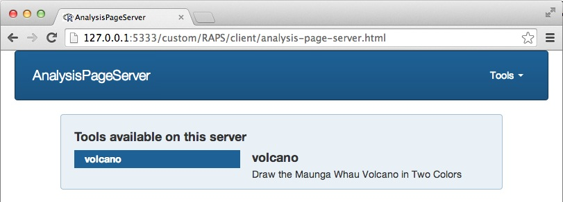</p>

This is the default landing page. The main feature is an index
of all the `AnalysisPage`s that we included in our Registry. Right now
there is only one.

Clicking on the "Tools" menu in the upper right opens a drop-down so
you can jump to another tool. In this example there is only one page
there:

<p class="centered">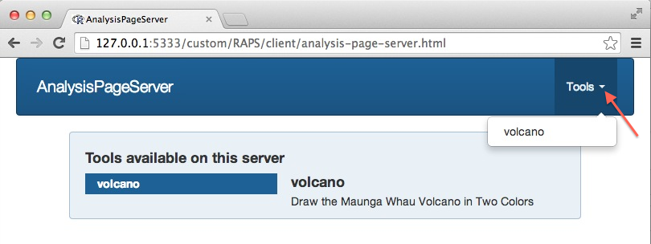</p>

Click on "volcano" (either on the main landing page or in the "Tools"
menu) to go to its "primary parameter area".

<p class="centered">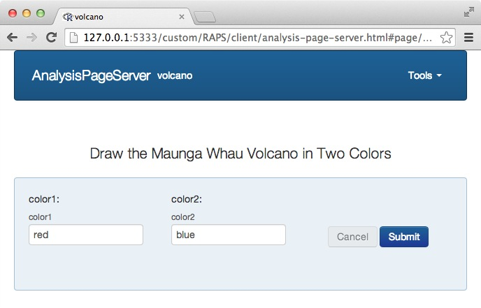</p>

Now we can see the two arguments of the handler function, `color1` and
`color2`, have been rendered as HTML text inputs, and prepopulated
with their default values. (This is default behavior, but there is a
rich syntax to define complex parameters, and this is explored below.)
Also note that the URL has updated. This
new URL, with the suffix `#page/volcano/primary`,
will automatically jump to the primary parameter area for the
`volcano` page. Clicking on `Submit` takes us to the analysis result:

<p class="centered">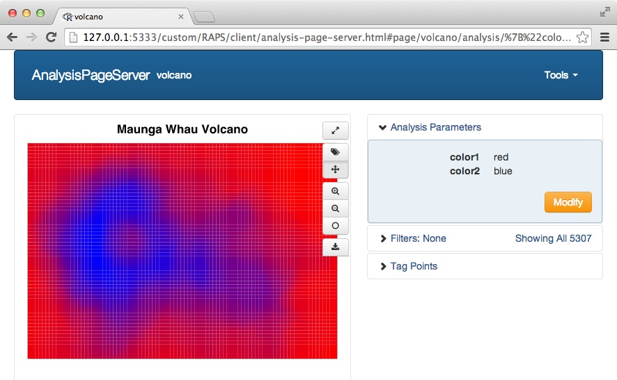</p>

This page features the plot (top left), a control area (top right) and the data table (below, but not
visible on this screen shot).

The interactivites discussed on the <a
href="Interactivity.html">Interactivity</a> documentation page, including **roll-over, filtering, zooming,
tagging and download**, are all available with this deployment. Since they are described in detail there no more
will be said about them here.
What's new is the "Analysis Parameters" section, which is a condensed version of the primary parmeter area and lets the user
see the inputs to the function. This section can also be used to repeat the analysis with modified parameters. First, click on Modify:

<p class="centered">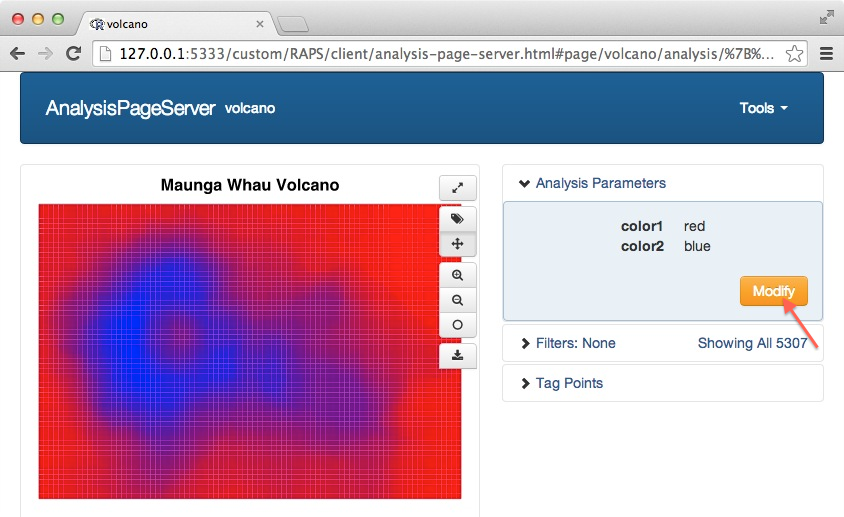</p>

Then input the new values and click "Change":

<p class="centered">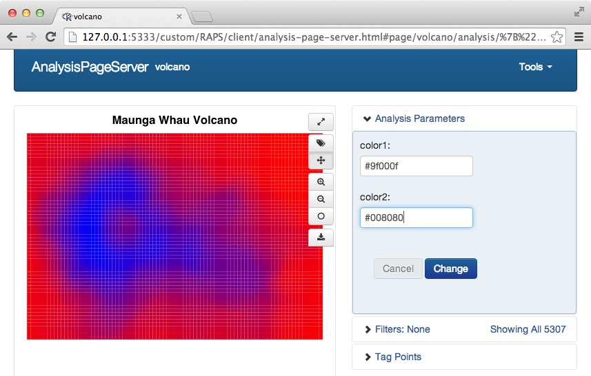</p>

and, voil&agrave;, the Maunga Whau Volcano in cranberry and teal:

<p class="centered">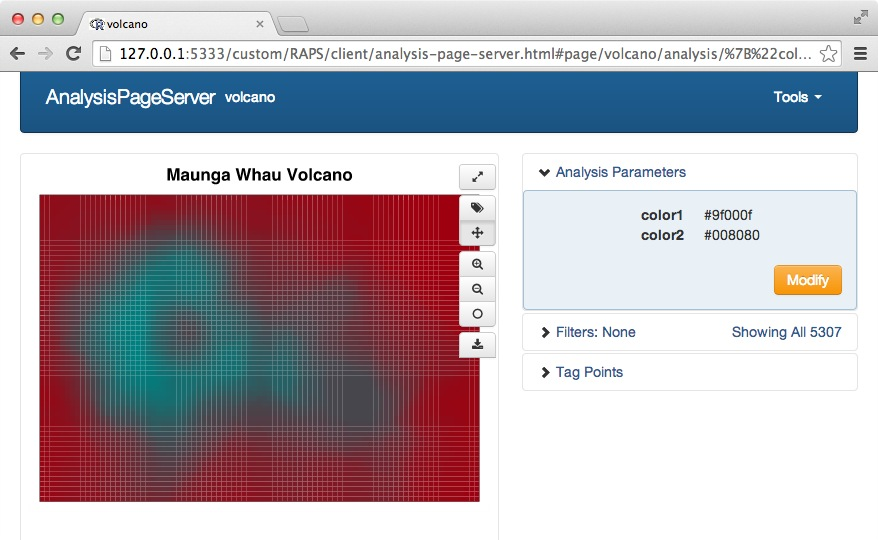</p>

Let's turn off the server in preparation for the next example.
  

```r
kill.process(srv)
```

"Rook >= 1.1 + fork not available"


-------------


## Multiple tools in one Application

If your registry has multiple `AnalysisPage`s then each one will
become a different tool in your
application. Let's add a boring page that has no parameters. It will plot
the speeds and distances from the `cars` dataset.

We have to duplicate the columns if we actually want to display the
data because the `$x` and `$y` fields are always stripped.


```r
cars.df <- cbind(x = cars$speed, y = cars$dist, cars)
cars.page <- new.analysis.page(function() {
  plot(cars.df$x, cars.df$y, xlab = "Speed", ylab =
       "Stopping Distance", pch = 19, col = adjustcolor(1, alpha.f = 0.6))
  cars.df
}, name = "cars", description = "Speed and Stopping Distances of Cars")
reg <- new.registry(cars.page, volcano.page)
srv <- startRookAnalysisPageServer(reg, port = port)
```

(No need to do the `on.exit(kill.process(srv))` again since the old
handler is still registered.)

Now the landing page has two tools on it.

<p class="centered">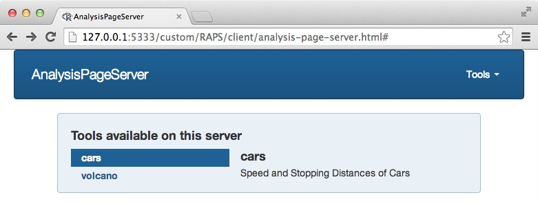</p>

If you roll over the name of
the tool you can see a short description:
  
<p class="centered">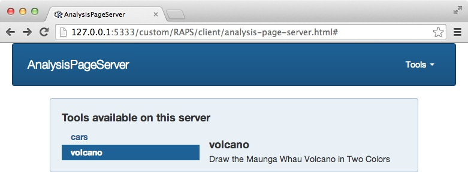</p>

The `cars` page has an empty parameter area:
  
<p class="centered">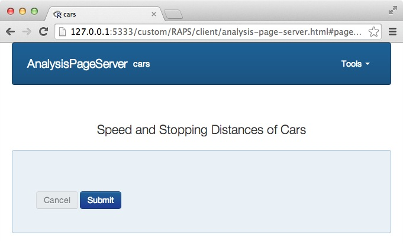</p>

And the plot:
  
<p class="centered">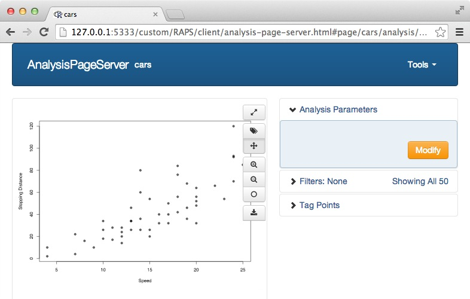</p>


```r
kill.process(srv)
```

"Rook >= 1.1 + fork not available"
  
## Parameter Construction

Each of the color parameters for the volcano example was rendered as a simple text input. Depending on the
default values of your handler function, different types of widgets will be used. The functions
`default.param.set` and `default.param` introspect your handler
function and decide what type of widget to render. These are called
automatically by the constructor for `AnalysisPage`s,
`new.analysis.page`, if you
don't provide a `param.set` argument explicitly. By using different default arguments you can build relatively complicated
input widgets. For example, a vector of length greater than 1 becomes
a drop-down menu.

These default parameters are covenient but they are not very good
engineering practices, because the default value is no longer an
actual parameter value but instead a signal for widget type. In
particular, if you
don't provide `skip.checks = TRUE` to `new.analysis.page()` it will actually run your handler
function once with the default values to make sure
you've given it something reasonable.

To specify your input widgets explicitly
you'll build an `AnalysisPageParam` for each input variable, and then put them all together into an
`AnalysisPageParamSet` using the constructor `param.set()`.

These are the constructors for the "atomic"
`AnalysisPageParam`s. These result in a single value being passed to
the function.

| constructor  | Description | Type within `R` |
| --- | --- | --- |
| `simple.param` | Simple text input elements  | Arbitrary Length-1 character vector |
| `slider.param` | Numeric slider-type parameter with min, max and step-size | Length-1 numeric vector |
| `select.param` | Select from a drop-down list or radio group | Length-1 character vector, but only from those defined in the drop-down choices |
| `bool.param`   | Toggle button | `TRUE` or `FALSE`, according to whether the button is pressed |
| `combobox.param` | Combobox-type parameter with search box and dropdown | Length-1 character vector |

The `combobox.param` takes the user input and calls back to the server to get a list of search hits. It requires including
a service-type (non-interactive) page to serve these search hits (or otherwise providing that service from some other accessible URL).

These constructors, which are variants of the atomic constructors, result in multiple selections:

| constructor  | `allow.multiple` parameter | Description | Type within `R` |
| --- | --- | --- | --- |
| `select.param` | `TRUE` | Select multiple values from a dropdown | Character vector of selected values. |
| `combobox.param` | `TRUE` | Combobox-type parameter with search box and dropdown, and option to select multiple values | Character vector of selected values |
  

These two constructors build more complex widgets that result in either arrays or lists:

| constructor  | Description | Type within `R` |
| --- | --- | --- |
| `array.param` | Expandable array of identical parameters  | List or vector of similarly-typed values (the choice of list or vector is decided by `toJSON`, since there is no difference in the front-end) |
| `compound.param` | Group of related parameters | The related parameters are packed into a list (or possibly a named vector) and sent to your function |

Since the function parameter values are always built by `toJSON` you should plan to write things a bit defensively. The main thing to remember
is that text-input numbers are passed as strings, so you have to call `as.numeric()` for a `simple` parameter
(although this is not necessary for a `slider` param), and that, given a JSON array, `toJSON` will
decide to build an R vector or list according to whether the objects have the same type. So don't assume you have either, and
either cast your vectors to lists with `as.list` or avoid using the `$` operator, which doesn't work on vectors.

The examples that follow attempt to demonstrate the main features of the `AnalysisPageParam` system. Reading the
documentation of the individual constructors will contain more information for specific cases.

For the first example we will re-use the same handler function from the volcano plot but
have its input widgets be drop-downs:


```r
color.choices <- c("red", "orange", "yellow", "green", "blue", "purple")
color1 <- select.param(name = "color1", label = "Low Color",
  description = "<strong>Select</strong> a color for the lowest parts of the volcano", choices = color.choices)
color2 <- select.param(name = "color2", label = "High Color",
  description = "<strong>Select</strong> a color for the highest parts of the volcano", choices = color.choices)
color.pset <- param.set(color1, color2)
volcano.page <- new.analysis.page(handler = volcano.handler,
                                  param.set = color.pset,
                                  name = "volcano",
                                  description = "Draw the Maunga Whau Volcano in Two Colors")
reg <- new.registry(volcano.page)
srv <- startRookAnalysisPageServer(reg, port = port)
```

Now the parameters look like this:

<p class="centered"></p>

Note that we've also had a chance to give the parameter a prettier display name
("Low Color" and "High Color") and a slightly longer description. This can really
help to improve the user experience, and it doesn't require any modification to
your handler function.

Also, since we've isolated the construction of the parameter widgets, we can define
our own constructors, and even re-use them between pages. For example, if our user has to choose
between six colors in several different pages, we can define a color parameter constructor
like this:


```r
color.param <- function(name = "color",
                        label = "Color",
                        description = "<strong>Select</strong> a color from the list", ...)  {
  select.param(name = name, label = label, description = description,
               choices = color.choices, ...)
}
```

And then wherever we need a color selector we've got the same one:


```r
color1 <- color.param("color1", label = "Low Color")
color2 <- color.param("color1", label = "High Color")
```


```r
kill.process(srv)
```

"Rook >= 1.1 + fork not available"

---------

## Slider parameter (with HTML response)

This example shows off the slider widget, and also shows how
to have your handler return HTML instead of the plot/dataset combination.


```r
slider <- slider.param(name = "n",  min = 0, max = 100, step = 1, value = 50,
                       description = "Select a number between 0 and 100")
handler <- function(n=50)  {
  ## n is already numeric for a slider---no need to cast with as.numeric(n)
  html <- paste0("<h3>This is an HTML response</h3>",
                 "<ul>",
                 "  <li>n = ", n, "</li>",
                 "  <li>n+1 = ", n+1, "</li>",
                 "</ul>")

  ## This is how to have your page return arbitrary HTML, rather than
  ## the typical plot/dataset combination
  new.datanode.html("html", html)
}
slider.page <- new.analysis.page(handler,
   param.set = param.set(slider),
   annotate.plot = FALSE,
   annotate.data.frame = FALSE,
   no.plot = TRUE,
   label  = "slider widget with HTML response")
reg <- new.registry(slider.page)
srv <- startRookAnalysisPageServer(reg, port = port)
```

Here is the widget:

<p class="centered">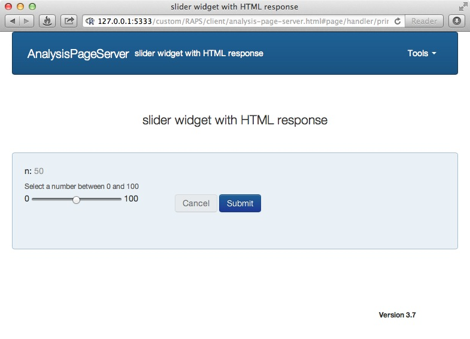</p>

And here is the rendered HTML response:

<p class="centered">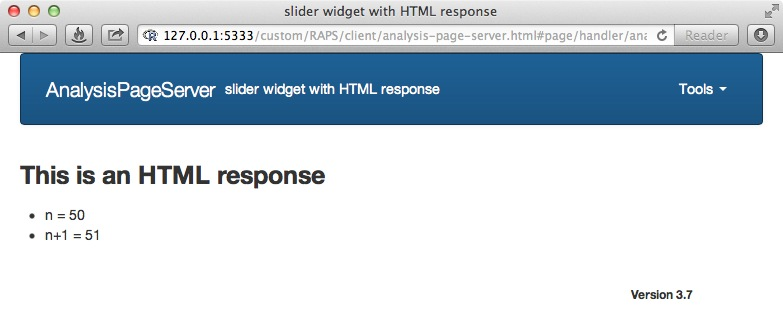</p>


```r
kill.process(srv)
```

"Rook >= 1.1 + fork not available"

--------

## Array parameter

The volcano plot is really a lot nicer with more colors so that finer differences in color
are revealed.

We could add a third color like this:


```r
volcano.handler <- function(color1 = "red",
                            color2 = "blue",
                            color3 = "green")  {

  par(mar=c(1, 1, 4, 1))
  chosen.colors <- c(color1, color2, color3)
  col <- colorRampPalette(chosen.colors)(50)
  image(datasets::volcano, xaxt = "n", yaxt = "n", main = "Maunga Whau Volcano",
        col = col, cex.main = 2)

  return(volcano.cells)  
}
```

What if the user wants 4 or more colors? One solution is to use an array-type parameter. This is done with
the constructor `array.param`. We pass a "prototype", in this case a single color picker, and
the user can add as many color pickers to the array as she wishes. We'll require that
the user have at least 2 colors, since a single color would be useless.


```r
volcano.handler2 <- function(colors = c("red","blue"))  {

  par(mar=c(1, 1, 4, 1))
  col <- colorRampPalette(colors)(50)
  image(datasets::volcano, xaxt = "n", yaxt = "n", main = "Maunga Whau Volcano",
        col = col, cex.main = 2)

  return(volcano.cells)  
}

one.color <- color.param()
color.array <- array.param(name = "colors", label = "Colors",
                           description = "Color the volcano from low to high altitude",
                           prototype = one.color,
                           min = 2, start = 2)
## Build an "AnalysisPageParamSet" with just 1 parameter, an array-type parameter
array.pset <- param.set(color.array)

volcano.page <- new.analysis.page(handler = volcano.handler2,
                                  param.set = array.pset,
                                  name = "volcano",
                                  description = "The Maunga Whau Volcano in Many Colors")
reg <- new.registry(volcano.page)
srv <- startRookAnalysisPageServer(reg, port = port)
```

Now the parameter area starts like this:

<p class="centered">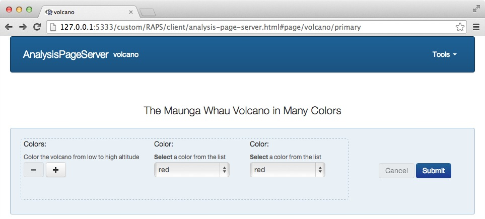</p>

(If you are trying to follow along yourself and you still see the 2-parameter example instead of
  the array then you may need to clear some cache, or directly refresh the parameter resource
 [http://127.0.0.1:5333/custom/RAPS/R/params?page=volcano](http://127.0.0.1:5333/custom/RAPS/R/params?page=volcano).)

  
The `-` and `+` buttons remove and add single color widgets respectively. Note that the `-` button starts disabled since
we said the minimum number of colors would be 2. Click on the `+` to get more color widgets:

<p class="centered">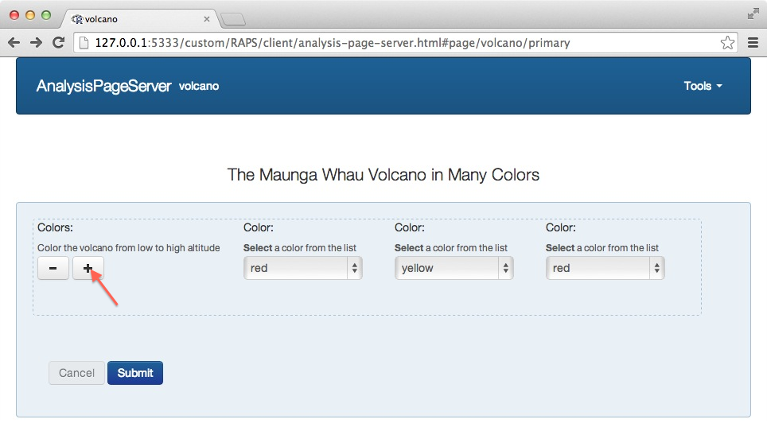</p>

And so on:

<p class="centered">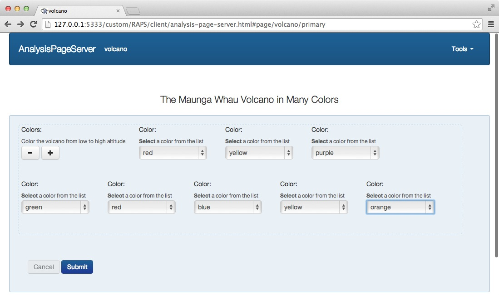</p>

and submit

<p class="centered"></p>


```r
kill.process(srv)
```

"Rook >= 1.1 + fork not available"

## Multiple selection parameter

Another way to allow for multiple selections is with the `allow.multiple` parameter of the `select.param`
constructor:


```r
multi.color.selector <- select.param(name = "color", label = "Color", description = "Select multiple colors",
                                     choices = color.choices, allow.multiple = TRUE)

volcano.page <- new.analysis.page(handler = volcano.handler2,
                                  param.set = param.set(multi.color.selector),
                                  name = "volcano",
                                  description = "The Maunga Whau Volcano in Many Colors")
reg <- new.registry(volcano.page)
srv <- startRookAnalysisPageServer(reg, port = port)
```

Now the parameter choices render as a multiple-selection dropdown:

<p class="centered">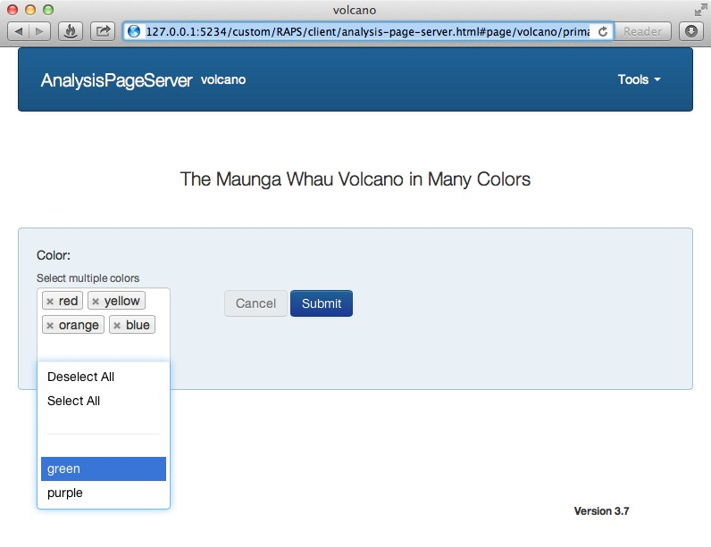</p>

The user can select as many of the choices from the menu. As they are chosen the accumulate in
the area above. "Select All" to select the remaining choices, and "Deselect All" to clear the
selection. After selecting, the order of the choices can be changed with drag-and-drop, and
individual choices can be removed by clicking the small `x`.


```r
kill.process(srv)
```

"Rook >= 1.1 + fork not available"

----------
  
## Comboboxes

A *combobox* is an input widget that has both a text entry area and then,
depending on what is typed there, a dropdown.

In order to have a combobox, we'll first need to set up a service
to return the search hits. This can be served from
outside your `AnalysisPage` application if you can avoid
cross-domain issues. This example will include the service in the same
application.


Let's have the user choose a city in a state. First we'll choose
the states from a drop-down, then choose a city.

This sets up some data structures on which we will compute:


```r
cities <- list(IL = c("Deerfield", "Springfield", "Chicago", "Urbana"),
  CA = c("San Francisco", "San Diego", "Los Angeles", "Sacramento"),
  MA = c("Deerfield", "Springfield", "Boston", "Camridge", "Arlington"))
states <- names(cities)
```


The `cities` service will return cities in a state:


```r
cities.service <- build.service(function(state) cities[[state]], name = "cities")
```


```r
state.dropdown <- select.param(name = "state", label = "State", description = "Choose a state",
                               choices = states)

city.cbx <- combobox.param(name = "city", label = "City", description = "Choose a city",
                           uri = '/custom/RAPS/R/analysis?page="cities"&state=":statename"', dependent.params = c(statename="state"))
```

The ":" indicates a token within the URI which will be substituted with the value of another input widget.
The `dependent.params` gives the mapping from tokens to parameter names. Here we'll replace
`:statename` with the value of the "state" dropdown.


```r
handler <- function(state = "MA", city = "Arlington")  {
  plot.new()
  plot.window(0:1, 0:1)
  mesg <- paste(sep = "", city, ", ", state, " is for lovers\nand data analysts.")
  text(0.5, 0.5, mesg, cex = 3)
  data.frame(x = numeric(), y = numeric())
}

page <- new.analysis.page(handler = handler,
  param.set(state.dropdown, city.cbx),
  name = "state",
  description = "Information about a city",
  annotate.plot = FALSE)

reg <- new.registry(cities.service, page)
srv <- startRookAnalysisPageServer(reg, port = port)
```

The primary parameter area starts like this:

<p class="centered">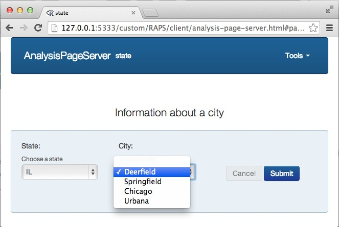</p>

The cities available are only those in Illinois. If the user chooses a different state
from the first dropdown then the second dropdown is populated with different city names:

<p class="centered">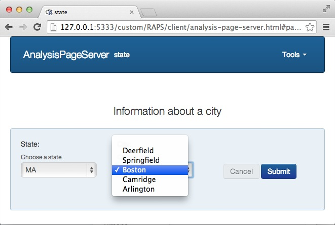</p>


```r
kill.process(srv)
```

"Rook >= 1.1 + fork not available"

Purists might argue that while having conditionally populated dropdown menus is useful
they are not true comboboxes, which are really a text/dropdown mixed input widget. In
`AnalysisPageServer` that is called a *self-dependent* combobox. The constructor is exactly
the same, just that the widget itself is a dependent parameter, and so whatever text is
typed in gets sent.

To demonstrate, we'll create a city searching service which only returns cities within the state
matching a query.


```r
## Extra "as.list" is necessary to force creation of JSON array for length 1
city.search.service <- build.service(function(state, query) as.list(grep(query, cities[[state]], value = TRUE)),
  name = "city_search")
city.cbx <- combobox.param(name = "city", label = "City", description = "Enter a search term to find a city",
                   uri = "/custom/RAPS/R/analysis?page=\"city_search\"&state=\":statename\"&query=\":query\"",
                   dependent.params = c(statename="state", query = "city"))
```

Note that "city" is now dependent on itself. That will make it a true combobox. We can now rebuild the `AnalysisPage`
with a different `AnalysisPageParameterSet`.


```r
page <- new.analysis.page(handler = handler,
  param.set(state.dropdown, city.cbx),
  name = "state",
  description = "Information about a city",
  annotate.plot = FALSE)

reg <- new.registry(city.search.service, page)
srv <- startRookAnalysisPageServer(reg, port = port)
```

Now the widget for "city" renders as a combobox instead of a dropdown.

<p class="centered">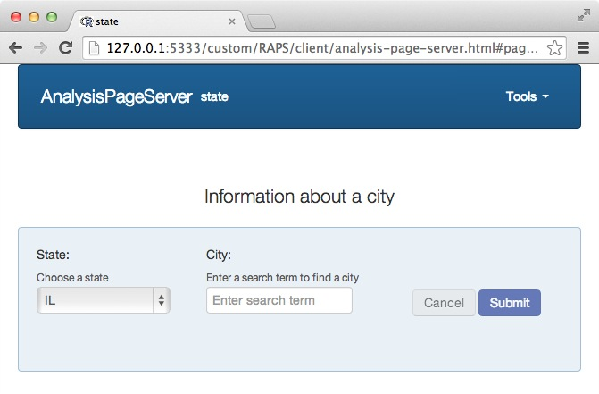</p>

After you type in a search term the options render below:

<p class="centered">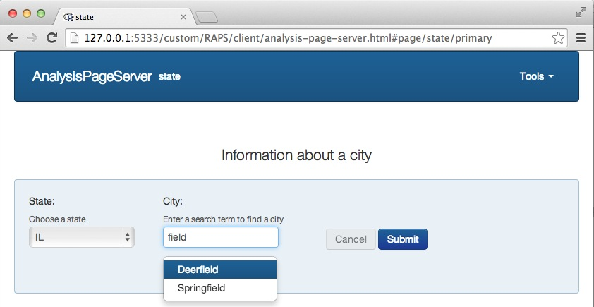</p>


Click on one and the text box collapses to your suggestion:
<p class="centered">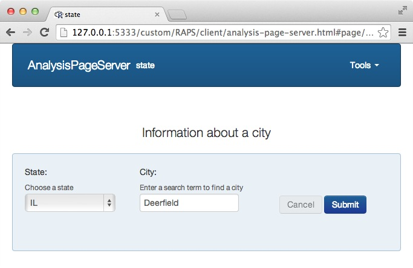</p>

> The combobox feature is relatively unstable under Rook, possibly due to
the quick successive AJAX calls triggered by keystrokes. You may need to
restart your server frequently. However, it behaves well under
[RApache](ApacheDeployment.html) and [FastRWeb](FastRWebDeployment.html).


```r
kill.process(srv)
```

"Rook >= 1.1 + fork not available"

-----------

## Persistent parameters

Until now all of the examples either had a single page or two completely independent pages,
between which no data passes. `AnalysisPageServer` has a very limited but still useful mechanism
to share information between the different pages in an application: *persistent parameters*.

Each application has a persistent parameter space, which is simply a hash-key lookup. This
is maintained strictly on the client side. What the server can do is couple certain parameters
to particular keys in this hash. Then all of the parameters tagged to a particular hash
key are now coupled---changing one on any page changes them on all the pages.

Persistent parameters could be used for example to select a data set, then have all of the pages analyze
the same data set. Or they could be used for some finer customizations. For example, if each page were
a different volcano, you might want to have the color array be persistent between the pages.

Let's work up the color example. We'll make an application that has two pages.

The key to this whole thing working is to set the argument `persistent` in whichever parameter
you want to be persistent. In this example we'll have two pages that each take a single parameter called "word".


```r
horiz.handler <- function(word = "word")  {
  plot.new()
  plot.window(0:1, 0:1)
  text(0.5, 0.5, word)
  data.frame(x = numeric(), y = numeric())
}

vert.handler <- function(word = "word")  {
  plot.new()
  plot.window(0:1, 0:1)
  text(0.5, 0.5, word, srt = 90)
  data.frame(x = numeric(), y = numeric())
}
```

Next, the "word" parameter on both pages is coupled to the persistent "word" parameter.


```r
word <- simple.param(name = "word", persistent = "word")

horiz.page <- new.analysis.page(horiz.handler, param.set(word), name = "horiz", label = "Horizontal")
vert.page <- new.analysis.page(vert.handler, param.set(word), name = "vert", label = "Vertical")

reg <- new.registry(horiz.page, vert.page)

srv <- startRookAnalysisPageServer(reg, port = port)
```

Here is the primary parameter area for the first page. We'll type in "foo" as the input word:

<p class="centered">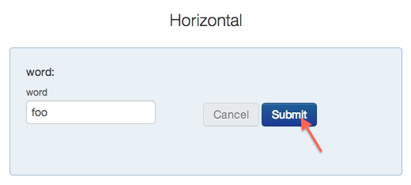</p>

The "foo" value does not persist until the user clicks "Submit".
After that, when the user next goes to the other tool, "word" will
start already with the value "foo":
  
<p class="centered">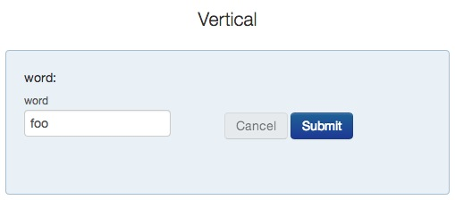</p>


```r
kill.process(srv)
```

"Rook >= 1.1 + fork not available"


---------------

## Advanced/hidden parameters

Any parameter can be made advanced by providing `advanced = 1` to its constructor. This means that by default
it will not show up unless the user exposes it by clicking the "advanced" icon.

Here is a very simple page which plots the sine function. The range will be from 0 to `xmax`, where the user
can type in `xmax`. The number of points used will default to 100, and the user will be allowed to change
that, but it will be a hidden, advanced parameter.


```r
xmax <- simple.param("xmax", label = "Maximum Theta", value = pi)
n <- simple.param("n", value = 100, advanced = 1)
pset <- param.set(xmax, n)

handler <- function(xmax = pi, n = 100)  {
  xmax <- as.numeric(xmax)
  n <- as.numeric(n)
  x <- seq(0, xmax, length = n)
  y <- sin(x)

  plot(x, y, pch = 19, xlab = "Theta", ylab = "Sine(Theta)", main = "Sine curve")

  data.frame(x = x, y = y, Theta = x, `Sin(theta)` = y, check.names = FALSE)
}

page <- new.analysis.page(handler, param.set = pset, name = "sine", label = "Sine Plotter")
reg <- new.registry(page)
srv <- startRookAnalysisPageServer(reg, port = port)
```

<p class="centered">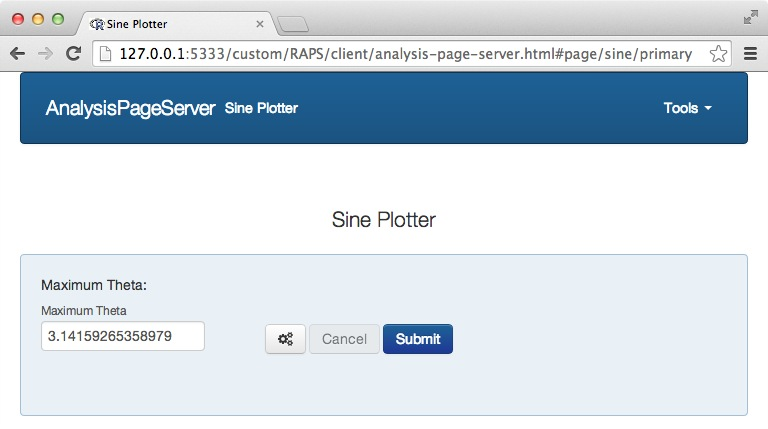</p>

Note the appearance of the advanced icon 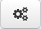
next to the Cancel and Submit buttons. This indicates that there are hidden advanced parameters.

<p class="centered">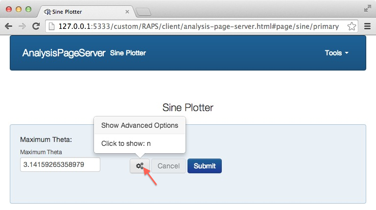</p>

Rolling over the icon lists which parameters are missing, and clicking on it exposes them:

<p class="centered">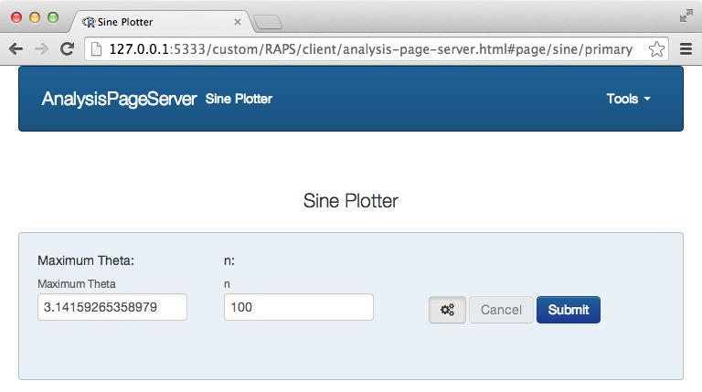</p>

> Note: When an analysis is submitted and advanced mode is *off*, the advanced parameter(s) are simply
omitted from the function call. Typically this means that the function would use the default
value for those parameters from the function definition. This does not necessarily match the
default value for that parameter in the front end.

"Rook >= 1.1 + fork not available"

----------------

## Conditional Parameters with "show.if"

Aside from making it advanced, the visibility of a parameter can also be controlled by making it conditional
on some other parameter.

Let's continue the example of the sine curve from the previous section. Let's suppose we want the user to be allowed to
specify either `xmin` or `xmax`. (We'll leave the widget for choosing `n` out of this example.)

We need three widgets---one to choose either `xmin` or `xmax`, and then one for each of `xmin` and `xmax`. And we need
to "program" the `xmin` and `xmax` to only display depending on the value of the first. This is
done with the `show.if` argument to the `AnalysisPageParam` constructor.


```r
extremum.chooser <- select.param("extremum", choices = c("xmin", "xmax"))
xmin <- simple.param("xmin", value = 0, show.if = list(name = "extremum", values = "xmin"),
                     label = "Minimum Theta",
                     description = "Set a minimum value for the range (max will be pi)")
xmax <- simple.param("xmax", value = pi, show.if = list(name = "extremum", values  = "xmax"),
                     label = "Maximum Theta",
                     description = "Set a maximum value for the range (min will be 0)")
pset <- param.set(extremum.chooser, xmin, xmax)

handler <- function(extremum = "xmin", xmin = 0, xmax = pi)  {
  xmin <- if(extremum == "xmin") as.numeric(xmin) else 0
  xmax <- if(extremum == "xmax") as.numeric(xmax) else pi
  x <- seq(xmin, xmax, length = 200)
  y <- sin(x)
  plot(x, y, pch = 19, xlab = "Theta", ylab = "Sine(Theta)", main = "Sine curve")
  data.frame(x = x, y = y, Theta = x, `Sin(theta)` = y, check.names = FALSE)
}
page <- new.analysis.page(handler, param.set = pset, name = "sine_with_extrema", label = "Sine Plotter")
reg <- new.registry(page)
srv <- startRookAnalysisPageServer(reg, port = port)
```

This page's parameter area starts out looking like this:

<p class="centered">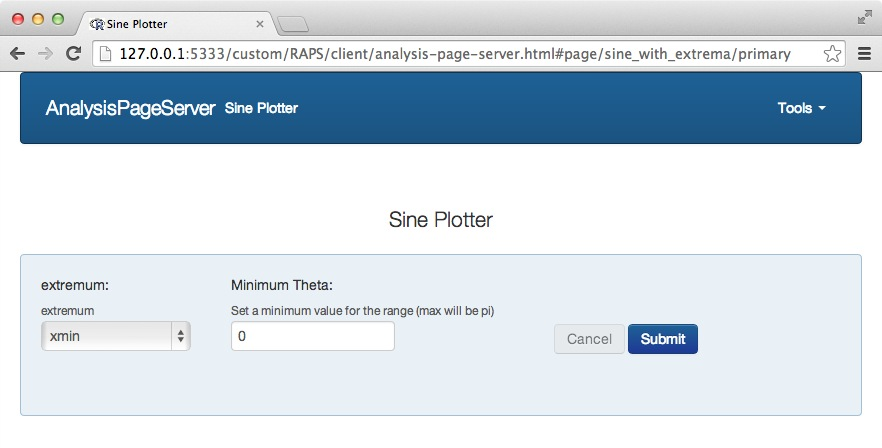</p>

If the user selects "xmax" for the extremum then the second widget changes:

<p class="centered">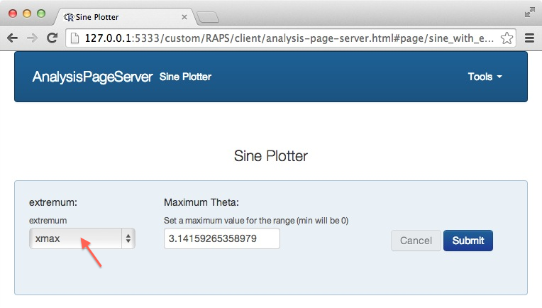</p>

Really two things happen---the `xmin` widget disappears and the `xmax` widget appears.

"Rook >= 1.1 + fork not available"

----------------

## Compound Parameters

Sometimes a finite set of parameters are logically linked. For example, in the previous section we had the 3 widgets to select an extremum.
If we added back in a widget to choose how many points, then it is somehow logically
distinct from the other three. It would be nice both from the user interface point of view and also
from the engineering point of view to reflect this. Let's put those three in a single "compound"-type parameter. Then
they will be visually separated from the fourth parameter for the user, and also provided to the handler packed into a single
list.

The constructor `compound.param` is expecting an `AnalysisPageParamSet`, the same object
that we can pass to `new.analysis.page`.


```r
range.paramset <- param.set(extremum.chooser, xmin, xmax)
range <- compound.param("range", children = range.paramset)
n <- simple.param("n", value = 100)
pset <- param.set(range, n)

handler <- function(range = list(extremum = "xmin", xmin = 0), n = 100)  {
  xmin <- if(range$extremum == "xmin") as.numeric(range$xmin) else 0
  xmax <- if(range$extremum == "xmax") as.numeric(range$xmax) else pi
  x <- seq(xmin, xmax, length = as.numeric(n))
  y <- sin(x)
  plot(x, y, pch = 19, xlab = "Theta", ylab = "Sine(Theta)", main = "Sine curve")
  data.frame(x = x, y = y, Theta = x, `Sin(theta)` = y, check.names = FALSE)
}
page <- new.analysis.page(handler, param.set = pset, name = "sine_with_extrema", label = "Sine Plotter")
reg <- new.registry(page)
srv <- startRookAnalysisPageServer(reg, port = port)
```

The parameter area now looks like this:

<p class="centered">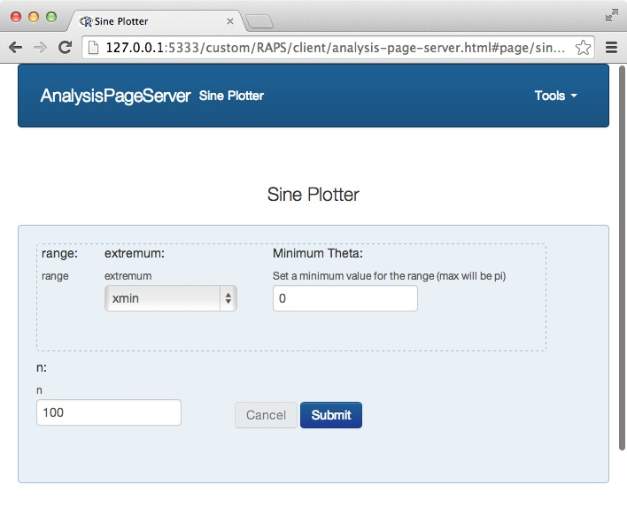</p>

Combining `show.if`, `array.param` and `compound.param` one can thus create arbitrarily nested and complex
parameters. For example, the `prototype` for an `array.param` could be a `compound.param`. Then each time the user
clicks on `+` a extra row of parameters would appear. This could be used to input first and last names for a list of
people.


```r
kill.process(srv)
```

"Rook >= 1.1 + fork not available"

# Next
[Deployment with Apache](ApacheDeployment.html)
