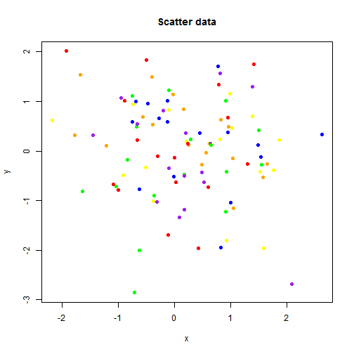
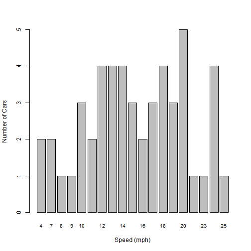
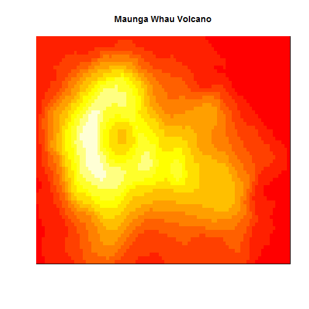

<!--
%\VignetteEngine{knitr::knitr}
%\VignetteIndexEntry{1. Making Static Content Interactive with AnalysisPageServer}
-->
<link rel="stylesheet" type="text/css" href="AnalysisPageServer.css">


# Static Content

The interactivity of the AnalysisPageServer front end (rollover, zoom,
tag, filter, sort, download, etc.) can be deployed on static
data, without setting up a server. You provide an SVG file and a data frame to annotate the elements of
that plot, and AnalysisPageServer does the rest of the work.
You can include multiple data sets in one page. Each data set
can have one or both plot and data.

-----------------------------

## Example: Scatter plot using base R graphics


Let's start with a simple scatter plot. We'll attach some string
and numeric data to each point.


```r
n <- 100
x <- rnorm(n)
y <- rnorm(n)
words <- rep(c("A","few","words"), length = n)
numbers <- rep(c(42, pi, 3, -1), length = n)
col <- rep(c("red","orange","yellow","green","blue","purple"), length = n)

scatter.data <- data.frame(x = x,
                           y = y,
                           words = words,
                           numbers = numbers,
                           colors = col)
head(scatter.data)
```

```
##             x          y words   numbers colors
## 1 -0.29727111 -0.1112748     A 42.000000    red
## 2  1.57713074 -0.5311747   few  3.141593 orange
## 3  0.92840780 -1.8110254 words  3.000000 yellow
## 4 -1.63133860 -0.8118456     A -1.000000  green
## 5 -0.01676479 -0.5103717   few 42.000000   blue
## 6  0.53108835 -0.6347136 words  3.141593 purple
```


Now let's make a little plot


```r
plot(x, y, main = "Scatter data", pch = 19, col = col)
```

 

OK. Now redo the plot but save it to an SVG file.


```r
plotfile <- tempfile(fileext = ".svg")
svg(plotfile, width = 9, height = 7)
plot(x, y, main = "Scatter data", pch = 19, col = col)
dev.off()
```

Now that you have data and an SVG plot, you are ready to make it interactive.
Use `static.analysis.page`.


```r
library(AnalysisPageServer)
result <- static.analysis.page(outdir = "static-example",
                               svg.files = plotfile,
                               dfs = scatter.data,
                               show.xy = TRUE,
                               title = "Random scatter data")
```

`static.analysis.page` consists of the following steps:

1. Create a new output directory (in this example called "static-example").
2. Populate the new directory with HTML, CSS and Javascript files that make up the front-end.
3. Add tags to your SVG file so the front end can find the elements of your plot, and save this modified file
somewhere within the new directory.
4. Save your data frame in a special JSON format, also within the new directory.

The return value is a list with `$URL` and `$paths.list` components. The `$URL` gives a URL that you can open in the browser and
`$paths.list` is a list with one entry for each dataset giving the
paths to its plot (`.svg`) and data (`.json`) files. (In this example
there is only one dataset, so `$paths.list` has length one, but see the
section below on including multiple datasets.)


```r
result
```

```
## $URL
## [1] "file:///C:\\Users\\friedmab\\AppData\\Local\\Temp\\RtmpCEvJez\\Rbuild10bc447f9ad\\AnalysisPageServer\\vignettes\\static-example\\analysis-page-server-static.html#datasets?dataset1.plot_url=data%2Fdataset%2D1%2Esvg&dataset1.data_url=data%2Fdataset%2D1%2Ejson"
## 
## $paths.list
## $paths.list[[1]]
## $paths.list[[1]]$plot
## [1] "data/dataset-1.svg"
## 
## $paths.list[[1]]$data
## [1] "data/dataset-1.json"
```


This link opens the example data set in a new window:

<a href="file:///C:\Users\friedmab\AppData\Local\Temp\RtmpCEvJez\Rbuild10bc447f9ad\AnalysisPageServer\vignettes\static-example\analysis-page-server-static.html#datasets?dataset1.plot_url=data%2Fdataset%2D1%2Esvg&dataset1.data_url=data%2Fdataset%2D1%2Ejson" target="_new">file:///C:\Users\friedmab\AppData\Local\Temp\RtmpCEvJez\Rbuild10bc447f9ad\AnalysisPageServer\vignettes\static-example\analysis-page-server-static.html#datasets?dataset1.plot_url=data%2Fdataset%2D1%2Esvg&dataset1.data_url=data%2Fdataset%2D1%2Ejson</a>

If you are following along in your own R session you can open the
link like this:


```r
browseURL(result$URL)
```

The client-side of the `AnalysisPageServer` make
many interactions possible to explore your data. The
[AnalysisPageServer Interactivity](Interactivity.html) page works
demonstrates these.

## Example: Barplot, Multiple datasets in one page

If you have more than one dataset then you can pass them both to the
front end to generate a richer report page.

Some of the datasets could have a plot with no data, or just data with
no plot.

As an example, we'll make a barplot and some data with no plot. We'll
use the `cars` dataset. This is one of the datasets that comes packaged
with R. It is a data frame with one row for each car measured. The
measurements were the speed at which the car was moving and the distance
required to stop.


```r
head(cars)
```

```
##   speed dist
## 1     4    2
## 2     4   10
## 3     7    4
## 4     7   22
## 5     8   16
## 6     9   10
```

We are going to look at the speed distribution---how many cars were
going at each speed. This will be a barplot, but it would be nice to
roll over each bar and get some summary statistics about the stopping
distances for the cars at that speed.


```r
## List of stopping distances for cars at each speed
dist.by.speed <- split(cars$dist, cars$speed)
## Average stopping distance for each speed (vector)
avg.dist <- sapply(dist.by.speed, mean)
## Number of measurements taken at each speed (vector)
n.at.speed <- sapply(dist.by.speed, length)
## Number of distinct speeds observed
n.speeds <- length(dist.by.speed)
## x-coordinates for bars in plot
x <- 1:n.speeds
## y-coordinates for bars in plot. For barplots the elements are
## recorded by their bottom coordinates, which are all 0 here
y <- rep(0, n.speeds)

barplot(n.at.speed, ylab = "Number of Cars", xlab = "Speed (mph)",
  cex.names=0.8)
```

 

Now reorganize the cars data so that it is a data frame with 
row corresponding to each bar in the barplot, that is to each
different speed. We'll also attach a summary of the stopping distances
for all the cars observed at that speed.


```r
dist.summaries <- t(sapply(dist.by.speed, summary))
colnames(dist.summaries) <- paste(colnames(dist.summaries), "Dist")
cars.data <- data.frame(x = x, y = y,
  speed = as.integer(names(avg.dist)), n = n.at.speed,
  dist.summaries, check.names = FALSE)
head(cars.data)
```

```
##    x y speed n Min. Dist 1st Qu. Dist Median Dist Mean Dist 3rd Qu. Dist
## 4  1 0     4 2         2         4.00         6.0       6.0         8.00
## 7  2 0     7 2         4         8.50        13.0      13.0        17.50
## 8  3 0     8 1        16        16.00        16.0      16.0        16.00
## 9  4 0     9 1        10        10.00        10.0      10.0        10.00
## 10 5 0    10 3        18        22.00        26.0      26.0        30.00
## 11 6 0    11 2        17        19.75        22.5      22.5        25.25
##    Max. Dist
## 4         10
## 7         22
## 8         16
## 9         10
## 10        34
## 11        28
```

Now we'll save the plot to an SVG.

>Note: In this document you can see I'm
plotting once without opening a device and then again to the SVG. In
a real interactive session that pattern might also be useful, to check how
your plot looks before writing the SVG, but only the second part,
writing the SVG, is actually required.


```r
plotfile2 <- tempfile(fileext = ".svg")
svg(filename = plotfile2, width = 9, height = 7)
barplot(n.at.speed, ylab = "Number of Cars", xlab = "Speed (mph)",
  cex.names=0.8)
dev.off()
```

I promised we'd include in this example a dataset that had only data
and no plot. Let's use the `iris` dataset from R.


```r
head(iris)
```

```
##   Sepal.Length Sepal.Width Petal.Length Petal.Width Species
## 1          5.1         3.5          1.4         0.2  setosa
## 2          4.9         3.0          1.4         0.2  setosa
## 3          4.7         3.2          1.3         0.2  setosa
## 4          4.6         3.1          1.5         0.2  setosa
## 5          5.0         3.6          1.4         0.2  setosa
## 6          5.4         3.9          1.7         0.4  setosa
```

To include a data frame without a plot, just
put an `NA` in the corresponding position of `svg.files`.
Now let's put it all together.


```r
svg.files <- c(plotfile, plotfile2, NA)
dfs <- list(scatter.data, cars.data, iris)
captions <- c("Random scatter data", "A summarization of the cars
dataset from R", "The iris data")

## We'll show the XY coordinates for the scatter data, where they have
## some meaning in interpreting the data, but not for the barplot,
## where they are only used to locate the plotted elements. The 
## third element of show.xy is ignored since there is no plot.
result <- static.analysis.page(outdir = "static-example2",
                     svg.files = svg.files,
                     dfs = dfs,
                     show.xy = c(TRUE, FALSE, TRUE),
                     title = captions)
result
```

```
## $URL
## [1] "file:///C:\\Users\\friedmab\\AppData\\Local\\Temp\\RtmpCEvJez\\Rbuild10bc447f9ad\\AnalysisPageServer\\vignettes\\static-example2\\analysis-page-server-static.html#datasets?dataset1.plot_url=data%2Fdataset%2D2%2Esvg&dataset1.data_url=data%2Fdataset%2D2%2Ejson&dataset2.plot_url=data%2Fdataset%2D3%2Esvg&dataset2.data_url=data%2Fdataset%2D3%2Ejson&dataset3.data_url=data%2Fdataset%2D4%2Ejson"
## 
## $paths.list
## $paths.list[[1]]
## $paths.list[[1]]$plot
## [1] "data/dataset-2.svg"
## 
## $paths.list[[1]]$data
## [1] "data/dataset-2.json"
## 
## 
## $paths.list[[2]]
## $paths.list[[2]]$plot
## [1] "data/dataset-3.svg"
## 
## $paths.list[[2]]$data
## [1] "data/dataset-3.json"
## 
## 
## $paths.list[[3]]
## $paths.list[[3]]$data
## [1] "data/dataset-4.json"
```

Follow the link to open this *three*-data set example in a new window. To
see the second or third data sets either scroll down or click on the "Data Sets"
menu in the corner.

<a href="file:///C:\Users\friedmab\AppData\Local\Temp\RtmpCEvJez\Rbuild10bc447f9ad\AnalysisPageServer\vignettes\static-example2\analysis-page-server-static.html#datasets?dataset1.plot_url=data%2Fdataset%2D2%2Esvg&dataset1.data_url=data%2Fdataset%2D2%2Ejson&dataset2.plot_url=data%2Fdataset%2D3%2Esvg&dataset2.data_url=data%2Fdataset%2D3%2Ejson&dataset3.data_url=data%2Fdataset%2D4%2Ejson" target="_new">Open the *three*-dataset report</a>


## Example: Image

This example shows how to annotate a heatmap or `image`. The only
trick here is that you need to know the order of the cells that the
graphics devices generates.

>Note: If you are ever confused about the order of plotting,
just make the SVG and then open it in a web browser. Do a right-click
`inspect element` and you can scroll through the SVG source and watch
the corresponding elements pop up.

We will use the volcano dataset from R. It is a beautiful matrix
giving the height of a volcano at different points. Ploting the
heights as a heatmap reveals the location of the volcano's caldera.


```r
image(volcano, xaxt = "n", yaxt = "n", main = "Maunga Whau Volcano")
```

 
Now the trick is that we have to take this square matrix and re-cast
it into a data frame with one row per cell. The secret is that the `y`
coordinates run faster than the `x`, and start in the bottom left.


```r
x <- rep(1:nrow(volcano), each = ncol(volcano))
y <- rep(1:ncol(volcano), nrow(volcano))
volcano.cells <- data.frame(x = x, y = y, Height = as.vector(t(volcano)))
head(volcano.cells)
```

```
##   x y Height
## 1 1 1    100
## 2 1 2    100
## 3 1 3    101
## 4 1 4    101
## 5 1 5    101
## 6 1 6    101
```

And now let's redo the plot and make the analysis page:


```r
plotfile3 <- tempfile(fileext = ".svg")
svg(filename = plotfile3, width = 9, height = 7)
image(volcano, xaxt = "n", yaxt = "n", main = "Maunga Whau Volcano")
dev.off()
result <- static.analysis.page(outdir = "static-example3",
                     svg.files = plotfile3,
                     dfs = volcano.cells,
                     show.xy = TRUE,
                     title = "Maunga Whau Volcano")
result
```

<a href="file:///C:\Users\friedmab\AppData\Local\Temp\RtmpCEvJez\Rbuild10bc447f9ad\AnalysisPageServer\vignettes\static-example3\analysis-page-server-static.html#datasets?dataset1.plot_url=data%2Fdataset%2D5%2Esvg&dataset1.data_url=data%2Fdataset%2D5%2Ejson" target="_new">Link to interactive page</a>


## Example: ggplot with facets

This example uses `ggplot2` to generate a multi-panel plot.
Because the plot has multiple panels the SVG elements will no longer 
be consecutive so you'll have to tell `static.analysis.page`
how many points are in each panel. It looks for the first group,
then starts looking for the next group where it left off looking for
the first group. This example uses the `mtcars` dataset.


```r
library(ggplot2)
plotfile4 <- tempfile(fileext = ".svg")
svg(filename = plotfile4, width = 7, height = 7)
p <- ggplot(mtcars, aes(mpg, wt)) + geom_point()
p + facet_grid(vs ~ am)
dev.off()
```

We do need to do some preparation of the data frame
before calling `static.analysis.page()`. The first
two columns have to be the `x` and `y` coordinates, so that
will be `mpg` and `wt`:


```r
df <- mtcars
xy.fields <- c("mpg", "wt")
df <- df[c(xy.fields, setdiff(names(df), xy.fields))]
head(df)
```

```
##                    mpg    wt cyl disp  hp drat  qsec vs am gear carb
## Mazda RX4         21.0 2.620   6  160 110 3.90 16.46  0  1    4    4
## Mazda RX4 Wag     21.0 2.875   6  160 110 3.90 17.02  0  1    4    4
## Datsun 710        22.8 2.320   4  108  93 3.85 18.61  1  1    4    1
## Hornet 4 Drive    21.4 3.215   6  258 110 3.08 19.44  1  0    3    1
## Hornet Sportabout 18.7 3.440   8  360 175 3.15 17.02  0  0    3    2
## Valiant           18.1 3.460   6  225 105 2.76 20.22  1  0    3    1
```

We have to plot them first
in order of the `vs` and `am` fields, so the rows will
also have to be reordered. `split()` and `rbind()`
can do this::


```r
groups <- unname(split(df, list(df$vs, df$am)))
df <- do.call(rbind, groups)
```

Finally we'll have to tell `static.analysis.page()` the
number of points in each panel:


```r
group.lens <- sapply(groups, nrow)
```

Now we can write out the page:


```r
result <- static.analysis.page(outdir = "static-example4",
                               svg.files = plotfile4,
                               dfs = df,
                               show.xy = TRUE,
                               title = "Motor Trend Cars Data",
                               group.length.vecs = group.lens)
```

<a href="file:///C:\Users\friedmab\AppData\Local\Temp\RtmpCEvJez\Rbuild10bc447f9ad\AnalysisPageServer\vignettes\static-example4\analysis-page-server-static.html#datasets?dataset1.plot_url=data%2Fdataset%2D6%2Esvg&dataset1.data_url=data%2Fdataset%2D6%2Ejson" target="_new">Link to interactive page</a>


-------------

## Next
[Embedding APS datasets in other documents](embedding.html)
